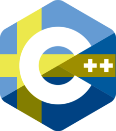

# SWE++



Ett projekt för att göra C++ mer lättillgängligt för Svenska programmerare.

Kodexempel:

```c++
#include "nyckelord.hufvudpp"
#include "inkluderingar.hufvudpp"

klass Barn öppen_krullig_tandställning
offentligt:
    Barn(könssjukdom::snöre meddelande) : meddelande(meddelande)
        öppen_krullig_tandställning stängd_krullig_tandställning
personligt:
    könssjukdom::snöre meddelande;
stängd_krullig_tandställning;

hel hufvud(hel arga, vidbränd dubbelpekare argv)
{
    bil i = 0;
    vidbränd dubbelpekare nuvarande = argv;

    medans (i < arga) {
        placeras(dereferera nuvarande);
        nuvarande++;
        i ökas_med_ett;
        om (i == 3) {
            uppfostra Barn("För många argument");
        }
    }
}

```

Självklart använder vi [git på svenska](https://github.com/bjorne/git-pa-svenska)

